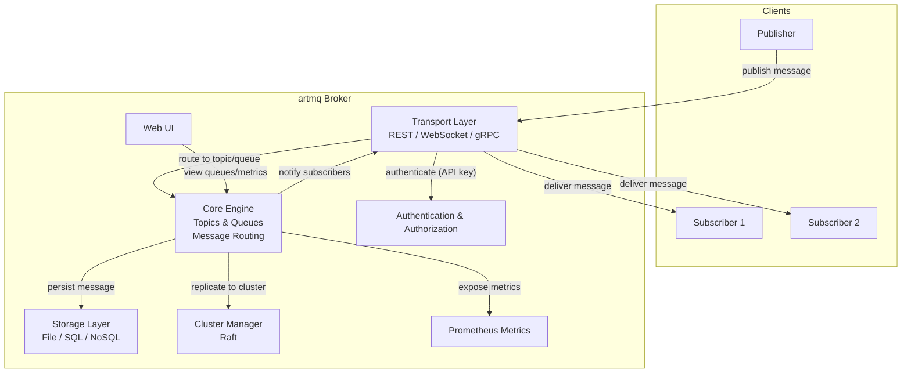

# artmq — высокопроизводительный брокер сообщений на Go

**artmq** — это полностью функциональный брокер сообщений, разработанный на Go для обеспечения асинхронного обмена данными между микросервисами. Реализует паттерны Pub/Sub и очереди сообщений, поддерживает персистентность, гарантии доставки и предоставляет удобный клиентский SDK.

---

## 📦 Основные возможности

### Базовый функционал

- **Pub/Sub** — публикация сообщений в топики с возможностью множественной подписки.
- **Очереди сообщений** — поддержка FIFO и LIFO (стек) дисциплин.
- **Управление топиками/очередями** — создание, удаление, просмотр.
- **Гибкая маршрутизация** — сообщения могут направляться как в топики, так и в очереди.

### Надёжность и персистентность

- **Сохранение на диск** — все сообщения хранятся в файловой системе (опционально: SQLite/PostgreSQL).
- **Восстановление после перезапуска** — брокер автоматически восстанавливает очереди, подписки и неотправленные сообщения.
- **Гарантия доставки** — реализован механизм *at‑least‑once* с подтверждениями (ack).

### Клиентская библиотека (SDK)

- **Язык:** Go (также доступна Python-обёртка при необходимости).
- Удобный API для публикации, подписки, управления очередями.
- Автоматическое переподключение при обрыве соединения.
- Обработка ошибок и таймаутов.

### Дополнительные функции

- **Приоритеты сообщений** — сообщения с высоким приоритетом обрабатываются раньше.
- **TTL (Time To Live)** — сообщения автоматически удаляются по истечении срока жизни.
- **Dead Letter Queue (DLQ)** — необработанные сообщения перемещаются в специальную очередь для анализа.
- **Метрики и мониторинг** — встроенный `/metrics` endpoint в формате Prometheus.
- **Аутентификация и авторизация** — поддержка API‑ключей и ролевой модели (admin, producer, consumer).
- **Кластеризация** — горизонтальное масштабирование через репликацию данных на основе Raft.
- **Web UI** — простая панель управления для просмотра очередей, сообщений и метрик.

---

## 🧱 Архитектура

---

## 🚀 Быстрый старт

### Запуск с Docker

```bash
docker run -d -p 8080:8080 -p 9090:9090 artmq:latest
